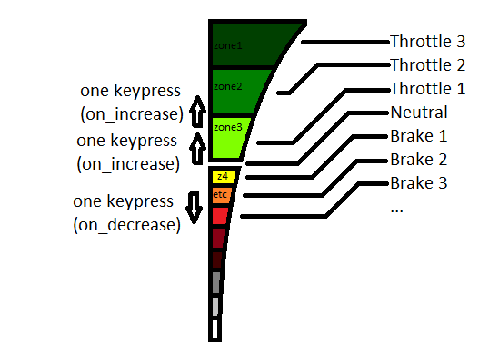
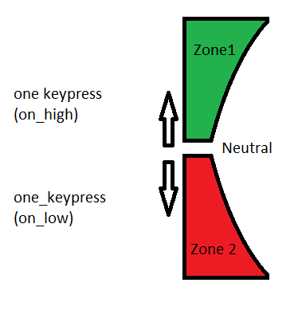

# HotasFCK
Thrustmaster T Flight Hotas X to Train Sim World 2 mapper.

A small tool in python to map joystick inputs to keyboard presses for the game.

Use it freely, but don't make money out of it.

Demo: https://www.youtube.com/watch?v=VoueXBKUCk8

### Backstory
So: I love this game, but playing on a keyboard is a bit boring after a while,
playing on a gamepad is a bit limited. I could use the RailDriver controller,
if it wouldn't be that expensive, but my freshly second-hand-purchased Hotas X is not.

The problems started when I tried to make it work in the game: it simply doesn't gave a... sign of taking the input from
the joystick.
Mapping the joystick with x360ce wasn't a good solution for me, because the game IMO doesn't have a good layout (e.g.
pushing forward the throttle of the joystick vs. clicking with the R2 trigger).

Also I wanted the controls to be a bit more realistic (e.g. the previously mentioned throttle should work similar to the
train's acceleration arm, so the break, etc.), so I started to think on my own solution, which you can see here.

### Requirements
I developed the script with the following parameters, you can experiment by changing, but I cannot guarantee that it
will work:
* OS: Windows 10 (currently the windows part is necessary, because the joystick_api uses the win32api with winmm.dll)
  (linux and macos ports are a maybe in the future)
* Python 3.9.4 and it's pip (was the latest when I started the script, no other reasons, maybe backwards-compatible,
  dunno')
* Train Sim World 2, Build number: 120, Steam edition (may work with other versions, technically the end results of the
  script are keyboard presses)
* A Thrustmaster T Flight Hotas X (for PC and PS3) in PC mode, no other gamepads or joysticks connected
  (the configs making it possible to use your own joystick or (custom built) controller as far as the game doesn't
  recognize it (if it does, that may interfere with the keypresses, or something similar uglyness))
* I have admin rights on my computer, didn't tested with less rights (shouldn't be a problem I think)

### Install
* Have the requirements
* Download the tool
* Execute `pip install -r requirements.txt` from the script's directory, or with the full path for the requirements.txt

### Configuration
At the time of writing this readme there are only limited trains and mappings are configured.

There is 3 main sections in the config: trains, selected_train and joystick.

1. The joystick section defines the joystick: it's name and which train function is mapped to which axis, button, etc.
   There is currently 3 types of mapping, which are:
    - zonal
      - The zonal config is applied to a joystick axis and requires a defined zone in the trains section (see below).
        With the zones defined, the script sends a keypress once the axis is moved from a zone to another. The pressed
        key is either the one defined in the on_increase or the one defined in the on_decrease field.
        
        This is useful for example for throttle of brake arms.
    - endpoint
      - The endpoint config is similar to the zonal config, but there is only 3 zones: the neutral, the lower than
        neutral and the higher than neutral. You can set the value of the neutral if you want, the default value is 
        65535/2=32767. If the axis is moved anywhere from the neutral, a key is pressed from on_low or on_high
        parameter.
        
        This is useful for example door opening.
    - button
      - The button config is a 1 to 1 bindig a joystick button to a keyboard button. If you press (or hold) the button,
        one keypress is sent.

2. The trains section defines the given train's features and maps it to a given zone on an axis.
For example: the 1972 Stock has a combined accelerator/brake arm, with a total of 12 positions (off, emergency brake,
multiple brake forces, neutral state, multiple acceleration forces, etc.). I prefer the neutral position to be mapped
to the middle of the joystick's throttle arm. If I push the arm away from me, there's the 3 acceleration states, if I
pull the arm towards me, there's the brake and other states. With this the axis is not separated equally. These "zones"
on the joystick's axis can be defined here. 
   
    You can define multiple trains here (future todo).
   
3. The selected_train section merges the joystick configurations to the trains configurations: which zone mapping is
applied to which axis, etc. If you want to drive another train, you should change the config and re-launch the script.

    (Future todo: add a button or hotkey to switch trains on-the-fly.)

### Launch and use
* Check your configs (see above)
* Start with `python start.py [--config C:\path\to\config.json]` where you can add your own config file if you want 
  (optional and experimental). Or use the default and don't give any parameters.
* Launch the game and enjoy :)
